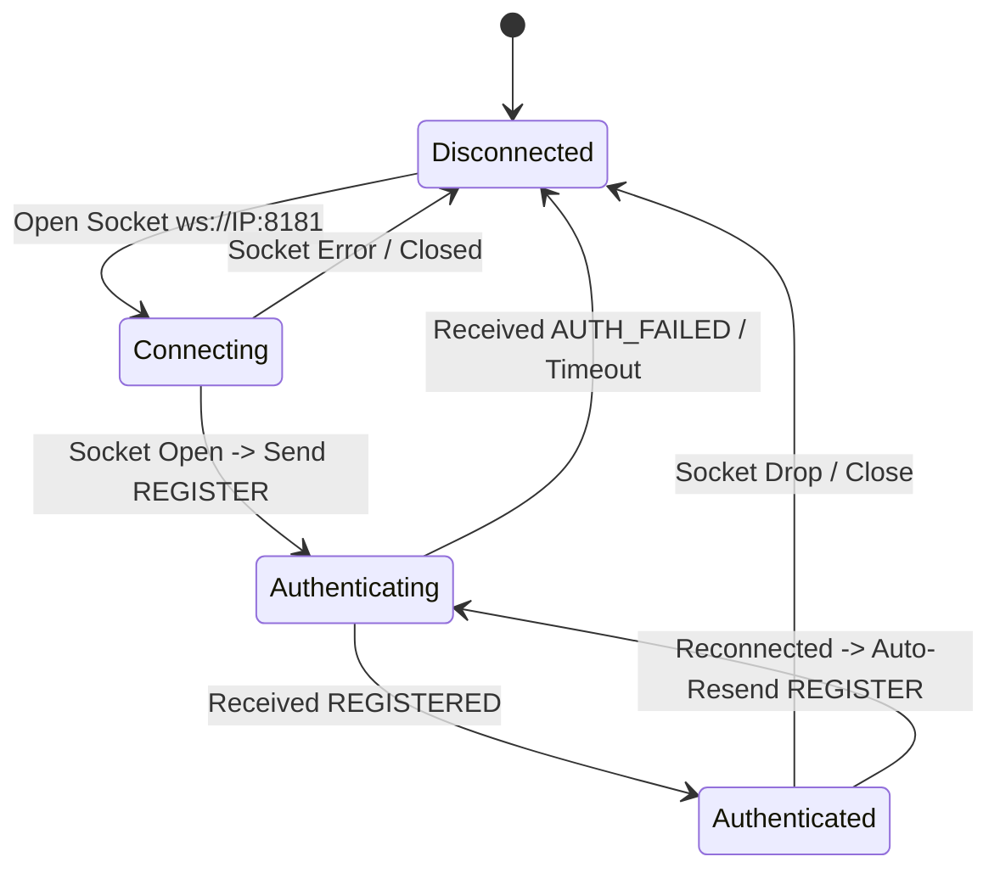
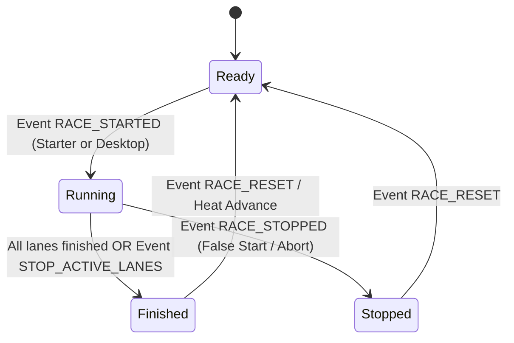

# AGENT SPECIFICATION: Boston Timing Mobile Client (React Native)

> **TARGET AUDIENCE**: AI Coding Agents (Claude Code, Cursor, Copilot, Antigravity, Aider) & Software Engineers.  
> **PURPOSE**: Complete technical specification and architectural contract for implementing the Android Mobile App of **Boston Timing System** using **React Native**.  
> **NOTE FOR AI AGENTS**: Do NOT include `deviceName` in any payload. Adhere strictly to the JSON schemas, enum values, and state transition invariants defined below.

---

## 1. System Architecture & Constraints

### 1.1. High-Level Topology
```
┌────────────────────────────────────────────────────────┐
│             Desktop Host (Windows WPF Server)          │
│  - WebSocket Server : ws://<SERVER_IP>:8181            │
│  - Web Scoreboard   : http://<SERVER_IP>:3000          │
└───────────────────────────▲────────────────────────────┘
                            │ Dedicated Local Wi-Fi (LAN)
                            ▼
┌────────────────────────────────────────────────────────┐
│         Android Mobile Client (React Native)           │
│  ├── Role: STARTER   (Start, False Start / Stop, Reset)│
│  ├── Role: REFEREE   (Lane Finish Timer, Split Record) │
│  ├── Role: CHIEF     (Backup All Active Lanes, Per-Lane)│
│  └── Role: SPECTATOR (Read-Only Live Scoreboard View)  │
└────────────────────────────────────────────────────────┘
```

### 1.2. Strict Agent Invariants & Constraints
1. **Zero Device Name Payload**: The mobile client MUST NOT include any `deviceName`, `deviceId`, or hardware identifiers in any WebSocket payload.
2. **Offline Local Network Operation**: The mobile application operates strictly on a local area network (LAN/WLAN) without internet access. Do NOT introduce dependencies requiring cloud services or external CDNs.
3. **Instantaneous Touch Response**: Lane stop actions MUST trigger on touch-down (`onTouchStart` or `onPressIn`), NOT on touch-up (`onPress` or `onClick`), to eliminate capacitive touch screen release delay.
4. **Haptic Confirmation**: Every operational action (`STOP_LANE`, `START_RACE`, `STOP_ACTIVE_LANES`) MUST emit immediate physical haptic feedback.
5. **Screen Lock Prevention**: The app MUST prevent the device display from dimming or sleeping while on race screens.
6. **Strict Schema Compliance**: Payload keys are case-sensitive camelCase strings as defined in Section 3.

### 1.3. Recommended Technology Stack
- **Framework**: React Native (Bare CLI or Expo SDK 51+)
- **Language**: TypeScript (Strict Mode)
- **Networking**: Native `WebSocket` API with exponential backoff reconnect logic
- **Hardware & UX APIs**:
  - Haptics: `expo-haptics` or `react-native-haptic-feedback`
  - Screen Wake Lock: `expo-keep-awake` or `react-native-keep-awake`
  - Barcode Scanner: `expo-camera` or `react-native-vision-camera`
  - Local Storage: `@react-native-async-storage/async-storage`
- **State Management**: Lightweight deterministic store (`zustand` or React Context)

---

## 2. Discovery, Connection, and Authentication

### 2.1. Discovery Mechanism
The mobile client establishes connection to the desktop server via two discovery modes:

1. **QR Code Pairing (Primary)**:
   - Desktop displays a QR code containing a serialized JSON string.
   - Mobile camera scans the QR code and parses the following payload schema:
   ```json
   {
     "ip": "192.168.1.4",
     "port": 8181,
     "accessCode": "7429",
     "wsUri": "ws://192.168.1.4:8181"
   }
   ```
2. **Manual Input (Fallback)**:
   - User inputs the Server IP address (`ip`) and the 4-digit Access Code (`accessCode`).
   - Client resolves WebSocket URI as: `ws://${ip}:${port || 8181}`.

### 2.2. Authentication Protocol (4-Digit Access Code)
- The server generates an ephemeral 4-digit numeric code (`1000` - `9999`) upon startup.
- The client MUST include this `accessCode` in the initial `REGISTER` command.
- If `accessCode` matches: Server responds with `REGISTERED` followed by `STATE_SYNC`.
- If `accessCode` is invalid: Server responds with `AUTH_FAILED`.
- If an unauthenticated client sends any operational command: Server responds with `AUTH_REQUIRED`.

---

## 3. WebSocket Protocol Specification

### 3.1. Client-to-Server Command Schema (`ClientCommand`)

Every message sent from Mobile to Desktop MUST adhere to this TypeScript type definition:

```typescript
type ClientRole = "Starter" | "Referee" | "Chief" | "Spectator";

type ClientAction =
  | "REGISTER"
  | "START_RACE"
  | "STOP_LANE"
  | "STOP_ACTIVE_LANES"
  | "RECORD_SPLIT"
  | "STOP_RACE"
  | "RESET_RACE"
  | "SYNC_REQUEST"
  | "PING";

interface ClientCommand {
  action: ClientAction;
  role?: ClientRole;
  laneNumber?: number;         // Required for Referee, optional for Chief (1-10)
  clientTimestamp?: number;    // Unix epoch in milliseconds (Date.now())
  estimatedLatencyMs?: number; // Calculated one-way network latency in ms
  accessCode?: string;         // Required for REGISTER action (4-digit string)
}
```

#### Client Command Field Matrix:
| Field | Type | Required For | Allowed Values / Range | Description |
| :--- | :--- | :--- | :--- | :--- |
| `action` | String | All commands | See `ClientAction` | Command identifier. |
| `role` | String | `REGISTER` | `"Starter"`, `"Referee"`, `"Chief"`, `"Spectator"` | Assigned role for this client session. |
| `laneNumber` | Number | `REGISTER` (if Referee), `STOP_LANE`, `RECORD_SPLIT` | Integer `1` to `10` | Target swimming pool lane. |
| `clientTimestamp` | Number | `PING`, `STOP_LANE`, `STOP_ACTIVE_LANES` | Positive Integer | Current client Unix timestamp (`Date.now()`). |
| `estimatedLatencyMs` | Number | `PING`, `STOP_LANE`, `STOP_ACTIVE_LANES` | Positive Float | Smoothed one-way latency derived from RTT. |
| `accessCode` | String | `REGISTER` | 4 numeric digits (`"1000"` - `"9999"`) | Authentication token. |

---

### 3.2. Server-to-Client Event Schema (`ServerEvent`)

Every message emitted from Desktop to Mobile follows this TypeScript type definition:

```typescript
type RaceState = "Ready" | "Running" | "Finished" | "Stopped";

type LaneStatus = "Ready" | "Running" | "Finished" | "DQ" | "DNS" | "DNF" | "OFF";

interface LaneStateDto {
  laneNumber: number;          // 1 - 10
  swimmerName: string;         // Swimmer full name
  club: string;                // Club / affiliation name
  seedTime: string;            // e.g. "00:28.50" or "--:--.--"
  rank: number | null;         // 1, 2, 3... or null if not finished
  status: LaneStatus;          // Lane operational status
  formattedTime: string;       // Formatted time string (e.g. "00:26.45")
  isRefereeConnected: boolean; // True if a referee is mapped to this lane
  isChiefConnected: boolean;   // True if chief is connected
  latencyMs: number;           // Network latency of assigned referee in ms
}

interface ClientSummaryDto {
  totalCount: number;
  startersCount: number;
  refereesCount: number;
  chiefsCount: number;
  spectatorsCount: number;
  averageLatencyMs: number;
}

interface ServerEvent {
  event: string;
  status?: RaceState;
  elapsedTime?: string;                // Format "mm:ss.ff" (e.g. "00:15.32")
  laneNumber?: number;
  finishTime?: string;                 // Format "mm:ss.ff"
  splitTime?: string;
  timestamp?: number;                  // Server Unix epoch ms
  clientTimestamp?: number;            // Echoed timestamp from client PING
  serverTimestamp?: number;            // Server timestamp when PONG emitted
  compensatedLatencyMs?: number;       // Latency deduction applied to the stop time
  lanes?: LaneStateDto[];              // 10-lane snapshot (delivered in STATE_SYNC)
  meetName?: string;                   // Swimming championship title
  eventNumber?: number;                // Current event number
  eventName?: string;                  // e.g. "50 M GAYA BEBAS PUTRA"
  heatNumber?: number;                 // Current heat number
  connectedClients?: ClientSummaryDto;
  accessCode?: string;                 // Active 4-digit code
  message?: string;                    // Human-readable diagnostic or error string
}
```

#### Server Event Catalog:
| Event (`event`) | Triggers & Preconditions | Expected Client Reaction |
| :--- | :--- | :--- |
| `REGISTERED` | Successful validation of `REGISTER` command | Transition UI to active role screen; initialize ping loop. |
| `AUTH_FAILED` | Incorrect `accessCode` submitted | Display authentication error dialog; prompt for code re-entry. |
| `AUTH_REQUIRED` | Command sent without prior registration | Route back to Connect/Auth screen; invalidate session. |
| `STATE_SYNC` | Initial connect, post-registration, or heat change | Replace local state with server state (meet info, lanes, timer, race status). |
| `RACE_STARTED` | Start command triggered | Start local high-resolution monotonic timer; set status to `Running`. |
| `CLOCK_TICK` | Broadcast every ~80ms during active race | Soft-sync display timer to eliminate clock drift with server. |
| `LANE_STOPPED` | Lane finish registered by referee, chief, or touchpad | Update lane status to `Finished`, record `finishTime`, disable stop button. |
| `LANE_SPLIT` | Split time recorded | Store split time entry for the respective lane. |
| `RACE_STOPPED` | False start or race aborted | Stop local timer; set status to `Stopped`. |
| `RACE_RESET` | Reset command executed | Reset local timer to `00:00.00`; set status to `Ready`. |
| `PONG` | Response to client `PING` | Calculate RTT and update `estimatedLatencyMs`. |
| `CLIENT_SUMMARY` | Client connect/disconnect event | Update connected client counters in status bars. |

---

### 3.3. Exact JSON Payload Samples (Reference Implementation)

#### Client Registration Payloads:
- **Referee (Lane 3)**:
  ```json
  {
    "action": "REGISTER",
    "role": "Referee",
    "laneNumber": 3,
    "accessCode": "7429",
    "clientTimestamp": 1726048123456
  }
  ```
- **Starter**:
  ```json
  {
    "action": "REGISTER",
    "role": "Starter",
    "accessCode": "7429",
    "clientTimestamp": 1726048123456
  }
  ```
- **Chief Referee**:
  ```json
  {
    "action": "REGISTER",
    "role": "Chief",
    "accessCode": "7429",
    "clientTimestamp": 1726048123456
  }
  ```

#### Racing Commands:
- **Starter Starts Race**:
  ```json
  {
    "action": "START_RACE"
  }
  ```
- **Referee Stops Lane (Touch Finish)**:
  ```json
  {
    "action": "STOP_LANE",
    "laneNumber": 3,
    "estimatedLatencyMs": 4.5,
    "clientTimestamp": 1726048150123
  }
  ```
- **Chief Stops All Active Lanes (Backup Stop)**:
  ```json
  {
    "action": "STOP_ACTIVE_LANES",
    "estimatedLatencyMs": 5.2,
    "clientTimestamp": 1726048152000
  }
  ```
- **Ping Heartbeat**:
  ```json
  {
    "action": "PING",
    "clientTimestamp": 1726048160000,
    "estimatedLatencyMs": 4.2
  }
  ```

---

## 4. State Machines & Protocol Invariants

### 4.1. Client Connection State Machine



### 4.2. Race Lifecycle State Machine



### 4.3. Protocol Invariants
1. **Idempotent Lane Stops**: A lane in `Finished`, `DQ`, `DNS`, `DNF`, or `OFF` status MUST NOT transition back to `Running` upon receiving duplicate `STOP_LANE` commands.
2. **Selective Batch Stop**: `STOP_ACTIVE_LANES` MUST only affect lanes strictly in `Running` status. Any lane that previously recorded a finish time MUST retain its existing recorded time.
3. **Timer Monotonicity**: The local display timer MUST NEVER decrement while race status is `Running`.

---

## 5. UI/UX & Functional Requirements per Role

### 5.1. Role: Referee (Lane Timer)
- **Primary Objective**: Low-latency electronic stopwatch substitute at pool edge.
- **Display Elements**:
  - Assigned lane header with swimmer name, club, and seed time.
  - Large digital clock display (`mm:ss.ff`).
  - Network quality badge displaying current one-way latency (e.g., `RTT: 4ms`).
- **Touch Finish Button**:
  - Occupies $\ge 65\%$ of viewport area.
  - Colors: Active Green (`#16A34A`) while running; Dark Slate (`#0F172A`) once finished.
  - Event Handling: Intercept touch at `onPressIn` or `onTouchStart`.
  - Haptics: Trigger heavy vibration impact on touch.
  - Dispatch `STOP_LANE` immediately upon touch detection.
  - Disable further touch triggers once status shifts to `Finished`.
- **Secondary Split Button**:
  - Located beneath or beside the primary stop area.
  - Dispatches `RECORD_SPLIT` with `laneNumber`.

### 5.2. Role: Starter (Pistol / Start Official)
- **Primary Objective**: Initiate and control heat starts from the start rostrum.
- **Display Elements**:
  - Event number, event description, and current heat number.
  - Lane readiness matrix: Visual indicators showing which lanes have active referees connected.
  - Race status indicator (`Ready` / `Running` / `Finished` / `Stopped`).
- **Control Actions**:
  - `START_RACE` button: Prominent trigger, enabled only when status is `Ready`.
  - `STOP_RACE` button: Distinct red styling for false start aborts; enabled only when status is `Running`.
  - `RESET_RACE` button: Enabled when status is `Finished` or `Stopped` to reset the pool state for the next heat.

### 5.3. Role: Chief Referee (Supervisor & Backup)
- **Primary Objective**: Oversee all 10 lanes simultaneously and provide fail-safe backup stopping.
- **Display Elements & Controls**:
  - **Global Action: "STOP ALL ACTIVE LANES"**:
    - High-visibility banner button at top of view.
    - Dispatches `STOP_ACTIVE_LANES`.
    - Stops all currently swimming contestants simultaneously.
  - **10-Lane Overview Grid**:
    - Compact cards for lanes 1 through 10.
    - Each card displays: Lane Number, Swimmer Name, Current Status, Live/Final Time, and an individual `STOP` button.
    - Individual `STOP` button dispatches `STOP_LANE` with that specific card's `laneNumber`.

### 5.4. Role: Spectator (Passive Scoreboard)
- **Primary Objective**: Read-only display of heat results and live running times.
- **Display Elements**:
  - Ordered leaderboard table sorted by ranking (`rank`) and time (`formattedTime`).
  - Swimmer names, clubs, and penalty tags (`DQ`, `DNS`, `DNF`).

---

## 6. Timing Precision & Latency Compensation Algorithm

### 6.1. Ping-Pong RTT Calculation
The client MUST run a periodic ping task every 2000ms:
1. Record send time: $T_{\text{send}} = \text{Date.now()}$.
2. Transmit `{"action": "PING", "clientTimestamp": T_{\text{send}}, "estimatedLatencyMs": L_{\text{current}}}`.
3. Upon receiving `PONG` with echoed `clientTimestamp`:
   $$RTT = \text{Date.now()} - \text{event.clientTimestamp}$$
   $$L_{\text{one-way}} = \max\left(0, \frac{RTT}{2}\right)$$
4. Apply Exponential Moving Average (EMA) smoothing:
   $$L_{\text{smooth}} = (\alpha \times L_{\text{one-way}}) + ((1 - \alpha) \times L_{\text{previous}}), \quad \text{where } \alpha = 0.3$$
5. Supply $L_{\text{smooth}}$ in subsequent `estimatedLatencyMs` fields.

### 6.2. Clock Drift Compensation
While the race is running:
- The mobile app runs a local high-frequency render timer (e.g. via `requestAnimationFrame` or a 16ms interval).
- When the server broadcasts `CLOCK_TICK` containing `elapsedTime` (e.g. `"00:14.80"`):
  - Parse the server elapsed time to milliseconds.
  - If the absolute difference between local clock and server clock exceeds $150\text{ ms}$, smoothly adjust the local base offset to synchronize with the server.

---

## 7. Edge Cases & Resilience Strategy

| Edge Case Scenario | Expected Agent Architecture & Handling |
| :--- | :--- |
| **Wi-Fi Packet Drop / Temporary Disconnect** | Socket error handler initiates reconnection loop (2s delay). Upon re-establishing socket, immediately send `REGISTER` with cached credentials. |
| **App Backgrounding / Screen Sleep** | Enforce permanent screen wake lock using `KeepAwake` module. If backgrounded, request full `SYNC_REQUEST` immediately upon returning to foreground. |
| **Server Restarts or Rotates Access Code** | Server responds to commands with `AUTH_FAILED`. App clears active session and presents connection modal requesting the new 4-digit code. |
| **Double-Tap Jitter on Finish Button** | Disable touch responder immediately upon first `onPressIn` trigger; reject touches occurring within 2000ms of a successful stop trigger. |
| **Mid-Race Heat Desynchronization** | If `eventNumber` or `heatNumber` in any server event differs from local state, trigger immediate full state replacement from the event payload. |

---

## 8. Verification & Acceptance Criteria

When evaluating or generating the mobile client implementation, verify against the following test assertions:

- [ ] **No Device Name Verification**: Verify zero occurrences of `"deviceName"`, `"deviceId"`, or hardware strings in any outgoing WebSocket frame.
- [ ] **Auth Enforcement**: Submitting an incorrect 4-digit access code triggers `AUTH_FAILED` handling without crashing.
- [ ] **Touch Timing**: Touch finish triggers at timestamp of contact (`onPressIn`), verifiable via timestamp comparison with haptic trigger.
- [ ] **Chief Backup**: Emitting `STOP_ACTIVE_LANES` halts all running lanes while leaving previously finished lanes untouched.
- [ ] **Network Loss Recovery**: Disconnecting and reconnecting Wi-Fi re-authenticates automatically and updates the state via `STATE_SYNC`.
- [ ] **Monotonic Display**: Race timer renders smoothly from `00:00.00` upwards without negative skips or stutter during `CLOCK_TICK` sync.
