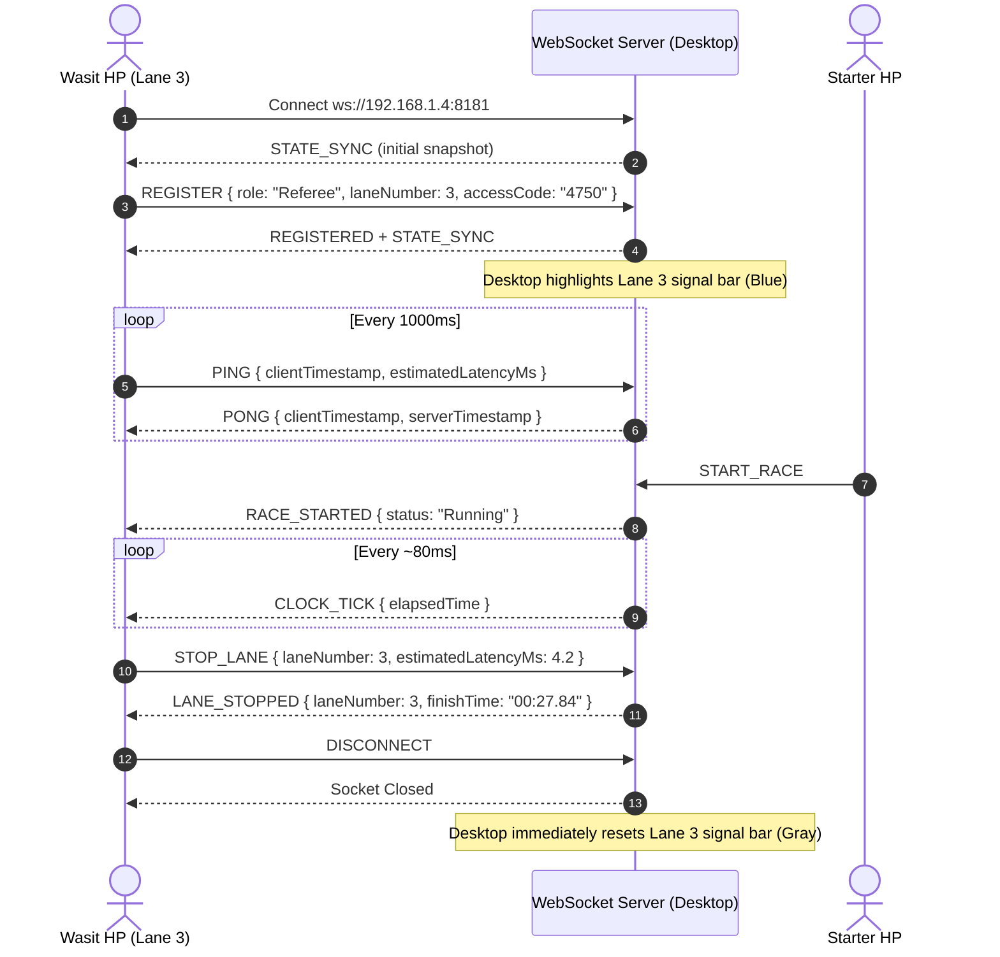

# Boston Timing System - WebSocket Event Messages Specification

> **Target Audience**: AI Agents, Mobile Developers (React Native / Flutter / Web), and System Integrators.  
> **Protocol**: Raw JSON over WebSocket (`ws://<SERVER_IP>:8181`).  
> **Server Engine**: .NET 10 WPF Timing Core with ClosedXML Meet Manager.  
> **Last Updated**: September 2026

---

## 1. Architectural Overview & System Rules

1. **Server Authority**: The desktop server is the single source of truth for official timing, clock ticks, results, and rank calculation.
2. **Authentication**: All operational roles (`Starter`, `Referee`, `Chief`) must submit a valid **4-digit numeric Access Code** (e.g. `"4750"`) generated by the desktop server. Unauthenticated commands are rejected with `AUTH_REQUIRED` or `AUTH_FAILED`.
3. **No Global Stop from Mobile**: Stopping a race globally cannot be triggered from mobile clients (`STOP_RACE` has been removed). Racing concludes when:
   - All participating lanes finish or receive status penalties (`Finished`, `DQ`, `DNF`), which auto-stops the race.
   - Chief referee triggers backup stop for active running lanes (`STOP_ACTIVE_LANES`).
   - Desktop race administrator manually clicks Stop All on the master console.
4. **No `CLIENT_SUMMARY` Broadcast**: Client connection summary statistics are kept on the desktop server and are not broadcast to mobile devices.
5. **10-Lane Swimming Pool Indexing**:
   - Swimming competition pools with 10 lanes use lane numbers **`1, 2, 3, 4, 5, 6, 7, 8, 9, and 0`**.
   - The 10th lane is numbered **`0`** (NOT `10`). If a referee is assigned to lane 10, send `"laneNumber": 0`.
6. **Liveness & Heartbeat Requirement**:
   - Mobile clients **MUST** send `PING` every **1,000ms** (1 second).
   - If no message or ping is received from a client within **3,000ms** (3 seconds), the server terminates the connection and immediately clears the referee signal indicator on the desktop screen.
   - When a referee leaves the lane screen, navigates back, or disconnects, the mobile client **MUST** emit `DISCONNECT` or `UNREGISTER` so the signal indicator clears immediately.

---

## 2. Complete TypeScript Type Definitions

```typescript
// ==========================================
// 1. Roles and States
// ==========================================

export type ClientRole = "Starter" | "Referee" | "Chief" | "Spectator";

export type RaceStatus = "Ready" | "Running" | "Finished";

export type LaneStatus = 
  | "Ready" 
  | "Running" 
  | "Finished" 
  | "DQ" 
  | "DNS" 
  | "DNF" 
  | "OFF";

// ==========================================
// 2. Client Commands (Mobile -> Server)
// ==========================================

export type ClientAction =
  | "REGISTER"
  | "PING"
  | "START_RACE"
  | "STOP_LANE"
  | "RECORD_SPLIT"
  | "STOP_ACTIVE_LANES"
  | "RESET_RACE"
  | "SYNC_REQUEST"
  | "DISCONNECT"
  | "UNREGISTER";

export interface ClientCommand {
  /** The command action identifier */
  action: ClientAction;

  /** Assigned user role (Required for "REGISTER") */
  role?: ClientRole;

  /** Target lane (1-9, or 0 for 10th lane). Required for "Referee" and "STOP_LANE" */
  laneNumber?: number;

  /** Device human-readable name (Optional) */
  deviceName?: string;

  /** 4-digit access code for authentication (Required for operational roles on "REGISTER") */
  accessCode?: string;

  /** Client Unix epoch timestamp in milliseconds (Date.now()) */
  clientTimestamp?: number;

  /** One-way network latency in ms calculated by client from PING-PONG RTT */
  estimatedLatencyMs?: number;
}

// ==========================================
// 3. Server Events (Server -> Mobile)
// ==========================================

export type ServerEventType =
  | "REGISTERED"
  | "AUTH_FAILED"
  | "AUTH_REQUIRED"
  | "STATE_SYNC"
  | "RACE_STARTED"
  | "CLOCK_TICK"
  | "LANE_STOPPED"
  | "LANE_STATUS_UPDATED"
  | "LANE_SPLIT"
  | "RACE_RESET"
  | "PONG"
  | "ACCESS_CODE_ROTATED";

export interface LaneStateDto {
  /** Lane number (1 to 9, or 0 for the 10th lane) */
  laneNumber: number;

  /** Full name of swimmer */
  swimmerName: string;

  /** Swimming club or contingency name */
  club: string;

  /** Seed entry time string (e.g. "00:28.50" or "--:--.--") */
  seedTime: string;

  /** Official ranking (1, 2, 3...) or null if not yet finished */
  rank: number | null;

  /** Lane operational status */
  status: LaneStatus;

  /** Formatted display time (e.g. "00:28.15" or "00:00.00") */
  formattedTime: string;

  /** True if a referee phone is currently connected to this lane */
  isRefereeConnected: boolean;

  /** True if chief referee is connected */
  isChiefConnected: boolean;

  /** Smoothed network latency of assigned referee in milliseconds */
  latencyMs: number;
}

export interface ServerEvent {
  /** Event identifier */
  event: ServerEventType;

  /** Current race engine status */
  status?: RaceStatus;

  /** Formatted elapsed stopwatch time (e.g. "00:15.32") */
  elapsedTime?: string;

  /** Target lane number (for LANE_STOPPED, LANE_STATUS_UPDATED, LANE_SPLIT) */
  laneNumber?: number;

  /** Recorded finish time */
  finishTime?: string;

  /** Recorded split lap time */
  splitTime?: string;

  /** Server Unix epoch timestamp (ms) */
  timestamp?: number;

  /** Echoed client timestamp from PING */
  clientTimestamp?: number;

  /** Server timestamp when PONG was emitted */
  serverTimestamp?: number;

  /** Latency compensation deducted by server (in ms) */
  compensatedLatencyMs?: number;

  /** Complete 10-lane snapshot array (delivered in STATE_SYNC) */
  lanes?: LaneStateDto[];

  /** Meet title (e.g. "Jakarta Open Aquatic Championship 2026") */
  meetName?: string;

  /** Current event number (e.g. 1) */
  eventNumber?: number;

  /** Current event name (e.g. "50m Freestyle Men") */
  eventName?: string;

  /** Current heat number (e.g. 1) */
  heatNumber?: number;

  /** Informational or error diagnostic message */
  message?: string;

  /** 4-digit access code (in REGISTERED and ACCESS_CODE_ROTATED) */
  accessCode?: string;
}
```

---

## 3. Detailed Client Commands (Mobile -> Desktop)

### 3.1. `REGISTER` (Authentication & Role Binding)
Sent immediately after establishing WebSocket connection.
```json
{
  "action": "REGISTER",
  "role": "Referee",
  "laneNumber": 3,
  "accessCode": "4750",
  "deviceName": "Galaxy S23 Wasit 3",
  "clientTimestamp": 1726048123456
}
```
- **Rules**:
  - `role`: `"Starter"`, `"Referee"`, `"Chief"`, or `"Spectator"`.
  - `accessCode`: Required for `Starter`, `Referee`, and `Chief`. Optional for `Spectator`.
  - `laneNumber`: Required for `Referee` (`1`-`9`, or `0` for the 10th lane).

---

### 3.2. `PING` (Heartbeat & Latency Measurement)
Must be sent every 1 to 2 seconds by all active mobile clients.
```json
{
  "action": "PING",
  "clientTimestamp": 1726048125000,
  "estimatedLatencyMs": 3.8
}
```
- Server responds with `PONG`. Client calculates round-trip time (`RTT = Date.now() - clientTimestamp`) and estimates one-way latency (`RTT / 2`).

---

### 3.3. `START_RACE` (Starter Role Only)
Triggers the race start signal.
```json
{
  "action": "START_RACE"
}
```
- Precondition: Race status must be `Ready`.

---

### 3.4. `STOP_LANE` (Referee Touch Finish / Chief Backup)
Registers the swimmer's finish on a specific lane.
```json
{
  "action": "STOP_LANE",
  "laneNumber": 3,
  "clientTimestamp": 1726048150123,
  "estimatedLatencyMs": 4.5
}
```
- The server calculates: `OfficialFinishTime = ArrivalTimestamp - TimeSpan.FromMilliseconds(estimatedLatencyMs)`.
- Precondition: Lane status must be `Running`.

---

### 3.5. `RECORD_SPLIT` (Lap / Split Time)
Records a split time without stopping the lane.
```json
{
  "action": "RECORD_SPLIT",
  "laneNumber": 3,
  "clientTimestamp": 1726048140123,
  "estimatedLatencyMs": 4.5
}
```

---

### 3.6. `STOP_ACTIVE_LANES` (Chief Referee Backup)
Stops all currently running lanes simultaneously with latency compensation.
```json
{
  "action": "STOP_ACTIVE_LANES",
  "clientTimestamp": 1726048155000,
  "estimatedLatencyMs": 5.0
}
```

---

### 3.7. `RESET_RACE` (Race Reset)
Resets the timer and ready states.
```json
{
  "action": "RESET_RACE"
}
```

---

### 3.8. `SYNC_REQUEST` (Request Full State)
Forces the server to reply with a fresh `STATE_SYNC` event.
```json
{
  "action": "SYNC_REQUEST"
}
```

---

### 3.9. `DISCONNECT` / `UNREGISTER` (Clean Role Teardown)
Sent when the user logs out, switches lane, or navigates back from a role screen.
```json
{
  "action": "DISCONNECT"
}
```
- Server immediately resets the referee lane connection on desktop to `isRefereeConnected = false` and closes the socket cleanly.

---

## 4. Detailed Server Events (Desktop -> Mobile)

### 4.1. `STATE_SYNC` (Full Snapshot)
The core synchronization event.
```json
{
  "event": "STATE_SYNC",
  "status": "Ready",
  "elapsedTime": "00:00.00",
  "meetName": "Jakarta Open Aquatic Championship 2026",
  "eventNumber": 1,
  "eventName": "50m Freestyle Men",
  "heatNumber": 1,
  "accessCode": "4750",
  "lanes": [
    {
      "laneNumber": 1,
      "swimmerName": "Rizky Pratama",
      "club": "Tirta Jaya Aquatic",
      "seedTime": "00:29.50",
      "rank": null,
      "status": "Ready",
      "formattedTime": "00:00.00",
      "isRefereeConnected": false,
      "isChiefConnected": false,
      "latencyMs": 0.0
    },
    {
      "laneNumber": 2,
      "swimmerName": "Budi Santoso",
      "club": "Millennium Aquatic",
      "seedTime": "00:28.10",
      "rank": 1,
      "status": "Finished",
      "formattedTime": "00:28.15",
      "isRefereeConnected": true,
      "latencyMs": 3.4
    },
    {
      "laneNumber": 0,
      "swimmerName": "",
      "club": "",
      "seedTime": "--:--.--",
      "rank": null,
      "status": "OFF",
      "formattedTime": "00:00.00",
      "isRefereeConnected": false,
      "latencyMs": 0.0
    }
  ]
}
```

---

### 4.2. `REGISTERED` (Authentication Success)
```json
{
  "event": "REGISTERED",
  "accessCode": "4750",
  "message": "Registered successfully as Referee for Lane 3"
}
```

---

### 4.3. `AUTH_FAILED` (Authentication Error)
```json
{
  "event": "AUTH_FAILED",
  "message": "Access Code salah! Masukkan 4 digit access code yang tertera pada server timing."
}
```

---

### 4.4. `RACE_STARTED` (Start Signal Triggered)
```json
{
  "event": "RACE_STARTED",
  "status": "Running",
  "timestamp": 1726048130000
}
```
- **Agent Action**: Start the local high-resolution monotonic timer immediately. Set status to `Running`.

---

### 4.5. `CLOCK_TICK` (Timer Periodic Soft-Sync)
Broadcast every ~80ms while a race is running.
```json
{
  "event": "CLOCK_TICK",
  "elapsedTime": "00:14.28"
}
```
- **Agent Action**: Adjust local display timer if difference exceeds 100ms. Do not cause UI stutter.

---

### 4.6. `LANE_STOPPED` (Single Lane Finished)
```json
{
  "event": "LANE_STOPPED",
  "laneNumber": 3,
  "finishTime": "00:27.84",
  "status": "Finished",
  "compensatedLatencyMs": 4.5
}
```
- **Agent Action**: Update the lane card to `Finished`, display the official `finishTime`, and disable the touch button for lane 3.

---

### 4.7. `LANE_STATUS_UPDATED` (Penalty or Status Change)
```json
{
  "event": "LANE_STATUS_UPDATED",
  "laneNumber": 3,
  "status": "DQ",
  "finishTime": "00:27.84",
  "message": "Lane 3 status updated to DQ"
}
```

---

### 4.8. `LANE_SPLIT` (Split Lap Recorded)
```json
{
  "event": "LANE_SPLIT",
  "laneNumber": 3,
  "splitTime": "00:13.40",
  "compensatedLatencyMs": 4.2
}
```

---

### 4.9. `RACE_RESET` (Timer Reset)
```json
{
  "event": "RACE_RESET",
  "status": "Ready",
  "elapsedTime": "00:00.00"
}
```
- **Agent Action**: Reset timer display to `"00:00.00"` and reset lane buttons to `Ready`.

---

### 4.10. `PONG` (Latency Heartbeat Response)
```json
{
  "event": "PONG",
  "clientTimestamp": 1726048125000,
  "serverTimestamp": 1726048125007,
  "timestamp": 1726048125007
}
```
- **Agent Action**: Compute `RTT = Date.now() - clientTimestamp` and feed into rolling average.

---

### 4.11. `ACCESS_CODE_ROTATED` (PIN Changed on Server)
```json
{
  "event": "ACCESS_CODE_ROTATED",
  "accessCode": "9123",
  "message": "Server access code updated: 9123"
}
```

---

## 5. Life-Cycle Sequence Diagram



---

## 6. Implementation Checklist for AI Agents Building Mobile App

- [x] **No Stop-Race button on mobile**: Ensure no button sends `STOP_RACE` or `RACE_STOPPED`. Mobile only touches individual lanes (`STOP_LANE`) or chief backup (`STOP_ACTIVE_LANES`).
- [x] **Ignore `CLIENT_SUMMARY`**: Do not build dependencies on `CLIENT_SUMMARY` events.
- [x] **Lane 0 Mapping**: Ensure the lane picker includes `1, 2, 3, 4, 5, 6, 7, 8, 9, 0`. When Lane 10 is chosen, transmit `"laneNumber": 0`.
- [x] **Automatic Ping Interval**: Start an interval timer upon receiving `REGISTERED` to transmit `PING` every 1,000ms.
- [x] **Clean Teardown**: In React Native `useEffect` cleanup or screen `beforeRemove` listener, invoke `socket.send(JSON.stringify({ action: "DISCONNECT" }))` prior to `socket.close()`.
